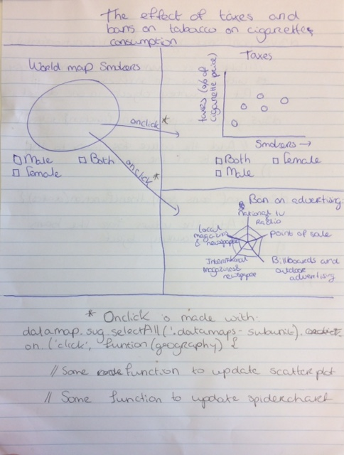

## Day 2
I made my design proposal.
In this drawing I show how I want to link my visualizations together and the
pseudocode I want to use to do that.

## Day 3
I started with making the html page. Also I made the different divs where my
vizualisations will be placed in later.

## Day 4
Today I added the buttons and drop down list to my html page.

## Day 5
I added a short introduction and made the map working.

## 11-06-2019
I tried to make the buttons of my world map working.

## 12-06-2019
Working on the update function for the line chart.

## 13-06-2019
The update function for the line chart is more or less working now.

## 14-06-2019
Tried to get bugs out of my update functions, didnt work that well yet.
Had a meeting and there some suggestions were made regarding that toppic.

## 17-06-2019
I fixed the bugs in my worldmap and linechart.

## 18-06-2019
I still have a problem with my x-axis for my linechart. But I am tryign to fix it.

## 19-06-2019
Added two scatterplots. I think it gives adds an overview for the user.

## 20-06-2019
Fixes the bug in my x-as. Furthermore I made borders around my divs, which makes
the design a bit bettter.

## 21-06-2019
I tried to update my design a bit, by changing the colors.

## 24-06-2019
Added text to the webpage. Also put the graphs in the right order.

TODO:
hightlihgy nbar
spacev legedn
black legend?
block text
