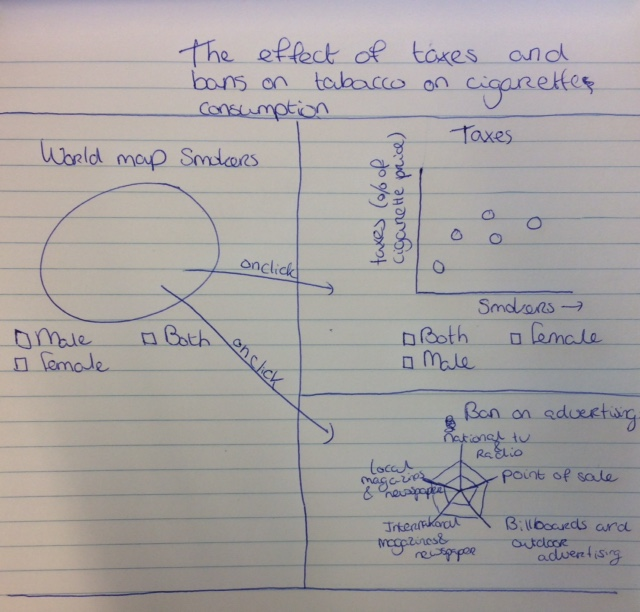

# Project

## Problem
Smoking is avoidable cause of death number one. Governments try to reduce smoking under their inhabitants by taking various steps. For example, rising taxes or ban commercials for sigarettes. The logical question is therefore: “Are there less smokers in countries where the government takes steps against smoking?”

## Solution
MVP: making a map with color coded how many smokers every country has. The user can hover over the countries to see the exact number of smokers.
There will be a scatterplot with the two variables smokers and taxes on cigarettes. The scatterplot will update when clicking on a certain country.
Also when clicking on a country, a spiderchart for that country will be shown. In the spiderchart the different kind of bans
on advertising will be displayed.
Optional: The user can select "Female", "Male" or Both for the world map and the scatterplot. The user can check checkboxes for the different kinds of advertising, then the corresponding countries will appear. Instead of using a map, a globe that the user can turn. Add time as an extra variable in the scatterplot.

## Links
http://apps.who.int/gho/data/node.main.1250?lang=en
http://apps.who.int/gho/data/node.main.TOB1307?lang=en
http://apps.who.int/gho/data/node.main.1291?lang=

## External
D3

## Similar
https://www.cdc.gov/statesystem/excisetax.html
Here the taxes on cigarettes in the USA are displayed on the map of the USA. I will probably also make a map, but then representing the number of smokers per country.
https://ourworldindata.org/smoking
The timeline that is used could be a nice idea to implement as an extra.

## Hardest part
The hardest part will be to link all the visualizations and make sure the updates work and work smoothly.
