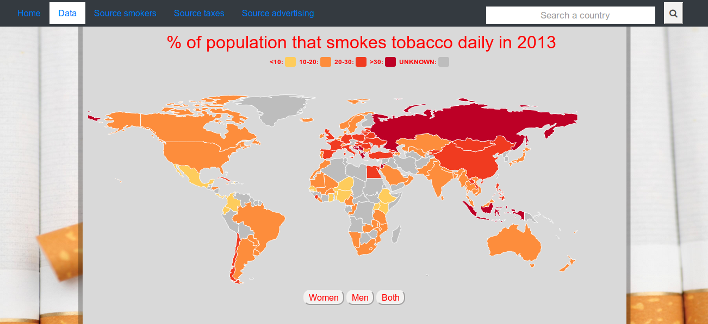
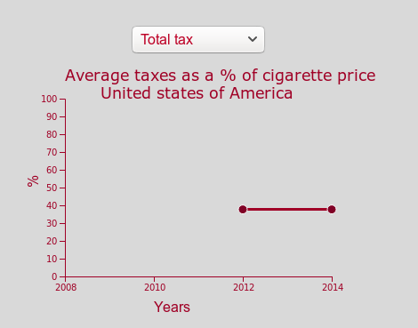
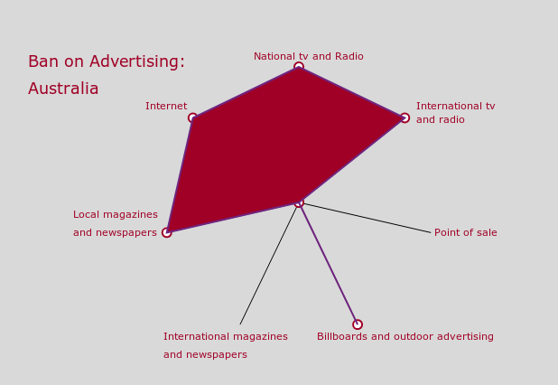
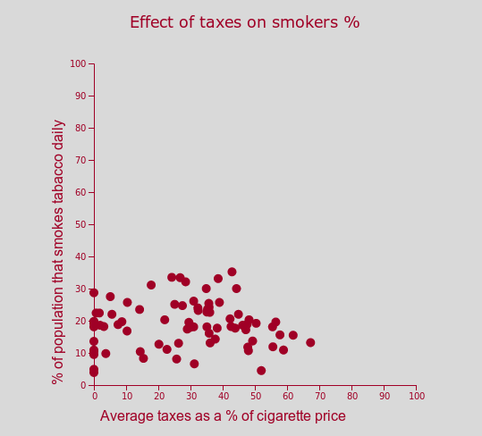
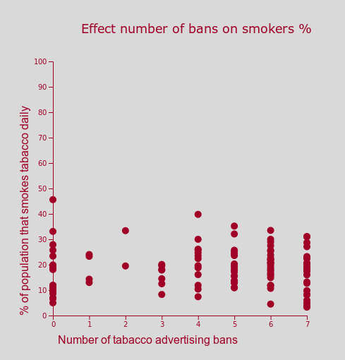

# The effect of advertising bans and taxes on the percentage of smokers in a country.
This data visualization is made by Elodie Rijnja.

## Percentage of smokers in a country
First an overview is given on how many people are smoking in every country.
It's possible for the user to also see this for males and females seperately.

## Taxes on cigarettes
A country on the map can be clicked in order to see the corresponding average
% of taxes of cigarette price in that country. Different types of taxes can be
chosen.

## Advertising bans
Furthermore, after clicking a country on the map, there will be shown how many
advertising bans a country has.

## Scatter plots
Since it's hard to keep an overview over the countries taxes, advertising bans
and the percentage of smokers, two scatterplots have been made. One containig the
parameters taxes and percentage of smokers. The other one containing advertising
bans and percentage of smokers.

## Search option

To make it more convenient for the user, there is a search bar. In this search
bar the user can type a country. After pressing the button, the scatter- and
spiderplot are updated to that country.

## Sources
http://jonsadka.com/blog/how-to-create-live-updating-and-flexible-d3-line-charts-using-pseudo-data
https://www.cdc.gov/tobacco/data_statistics/fact_sheets/fast_facts/
https://getbootstrap.com/docs/4.0/components/navbar/
https://blockbuilder.org/Ananda90/8269def4e60b17d57d358b2e8219f62d
https://bl.ocks.org/gordlea/27370d1eea8464b04538e6d8ced39e89
https://bl.ocks.org/mattdh666/b941fd20978cfad1398739c2563aee1f
https://www.w3schools.com/howto/howto_css_search_button.asp

d3-tip.js
https://raw.githubusercontent.com/markmarkoh/datamaps/master/dist/datamaps.world.min.js
datamaps.world.min.js

smoking.json
http://apps.who.int/gho/data/node.main.1250?lang=en
tax.json
http://apps.who.int/gho/data/node.main.TOB1307?lang=en
advertising.json
http://apps.who.int/gho/data/node.main.1291?lang=en

https://cancerfocusni.org/cancer-prevention/smoking/

## Copyright
Copyright, 26-06-2019, Elodie Rijnja. All Rights Reserved.
