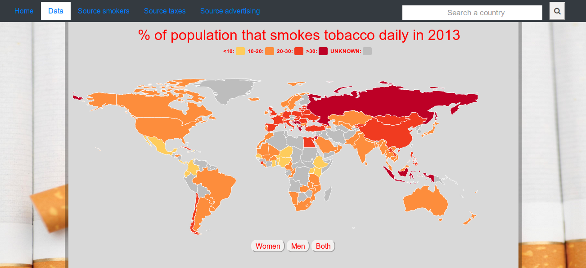

## Description

The web page is about the effect of advertising bans and taxes on the percentage
of smokers in a country.
On the map the % of smokers in a country is visualized. By clicking on a country,
the line graph (about taxes) and spider graph (about advertising bans) are
updated. In the line graph you can select different types of taxes.
Furthermore, the line and spider graph can also be updated by typing a country
in the search bar.
There is one scatterplot showing the relationship between taxes and % of smokers
and the other one between advertising bans and % of smokers.

## Technical design

#### Loading data
The functions that load the data are in the files that correspond to the chart
the data is used for. These functions are all called in the main function.

#### Making the charts
Every chart has an own file. In this file there is a function that loads the data
that is needed to make this chart, for example in tax.js there is makeTaxdata().
Furthermore, there is are functions in the file that make the chart and update
them if necessary, in tax.js that is makeLine() and updateLine().
All these functions are called in the main function. However, some of the
update functions are also called in the make_map.js file. This is since
the update is executed when clicking a country on the map.  

#### Helper functions
In the toCountryCode.js I made a dictionary with two functions,
in order to decode a country code to a country name and the other way around.
Also a function in serachUpdate.js is made, to update the line and spider chart
when a user types a country in the search box.

## Challenges
#### Code
I changed the way of loading in the data. First I thought it would be handy to
load it in in the following way:

d3.json("smoking.json").then(function(datas)){

  // Make object for each country with value for smokers. Put all country
  objects in one object.

  d3.json("taxes.json").then(function(datas)){

    // Add the value for taxes to the objects of the countries.
  })

  d3.json("advertising.json").then(function(datas)){

    // Add the values for the bans to the country object.
}

However, during the process I figured that it's much more clean to have one main
function where you call all the other functions from. In this function also the
data is loaded. This is also very handy, since then it's easy to use the
different data in all functions where you need them. Since you call these
functions in the main function, where the data is also loaded in.

I had a big problem with making the buttons of the world map work. Somehow
when clicking first 'women' or 'men' and then 'both', the both data would be
overwritten with the women or men data. I solved this by using Object.assign()
to asign the data of 'both' to an object called tempData. When loading the
map the first time, it was loaded with the tempData. When updating, the data
from both could now be used without that it's overwritten.

Furthermore, I had problems with the x axis of my line chart. Somehow the
dots where appearing between two values of the x axis, and not directly above it.
This was due to me using "scaleBand". Scaleband is normally used for bar charts,
therefore indicating where the bar should be. I fixed this problem by changing
"scaleBand" to "scaleLinear". 

#### Html
The html page is pretty much how I proposed it. Except for the fact that
I put all the divs in one big div, with the class "container" in the data.html.

## Decisions
Regarding the loading of the data, I think it's very good that I changed that.
In this way, it's easier to keep the overview over the whole. Which is one
of the most important things in such an exercise. For loading the data I
wouldn't have chosen an other solution that the current one.

If I would have more time, I would also have wanted to update the two
scatterplots that I made. The problem with that was that if I wanted to update
them, I should somehow add data. For example showing the relationship between
taxes and % of smokers over a different years, where the user can select the
year to be displayed.
